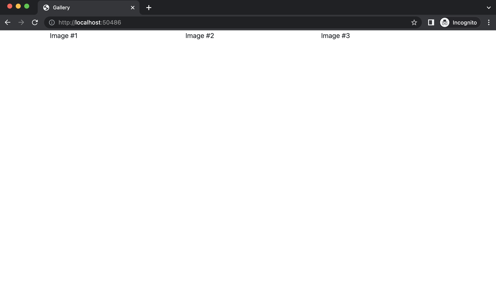
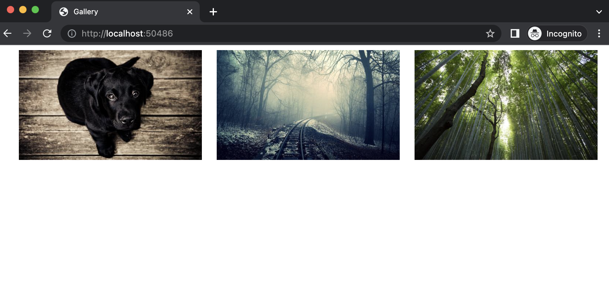

# Create initial layout with HTML and Bootstrap

### Setup

If you already have `serve` on your computer, you can skip the **Setup** part

#### Let's install [`serve`](https://www.npmjs.com/package/serve):

In a terminal run:

```
npm install -g serve
```

> [`nodejs`](https://nodejs.org/en/) & [`npm`](https://www.npmjs.com/) are required for the command abvove.

Serve will allow us to preview our website locally while developing it.

#### Run `serve`:

In a terminal/powershell run:

```
serve
```

You should see similar output:

```
┌───────────────────────────────────────────────────┐
│                                                   │
│   Serving!                                        │
│                                                   │
│   - Local:            http://localhost:50486      │
│   - On Your Network:  http://172.16.1.201:50486   │
│                                                   │
│   Copied local address to clipboard!              │
│                                                   │
└───────────────────────────────────────────────────┘
```

> *Note*: Don't close the terminal window, otherwise `serve` will stop and you won't be able to access the website.
>
> To close `serve` press `CTRL + C` while the terminal window is on focus (foreground).

### Open the url from `serve`

Click while holding `CTRL` on the link provided in the output of the `serve` command.

- **Local**: (recommended) - this URL is available only on your computer
- **On Your Network**: This URL is available to anyone connected to your network (your phone for example or another
  computer, great for sharing!)

### Create the markup

#### Container

Add a `<div>` inside index.html's `<body>`:

```html
...
<body>
<div class="container"></div>
</body>
...
```

> More about [Containers](https://getbootstrap.com/docs/5.0/layout/containers/#how-they-work)

#### Row

Inside the previously created `div.container`, add a new `<div>` with class `row`:

```html
...
<body>
<div class="container">
    <div class="row">

    </div>
</div>
</body>
...

```

> More about [Rows](https://getbootstrap.com/docs/5.0/layout/grid/#how-it-works) (third bullet)

#### Columns

Inside the previously created `div.row`, add 3 new `<div>`s, each with class `col-12 col-md-6 col-lg-4`:

```html
...
<body>
<div class="container">
    <div class="row">
        <div class="col-12 col-md-6 col-lg-4">
            Image #1
        </div>
        <div class="col-12 col-md-6 col-lg-4">
            Image #2
        </div>
        <div class="col-12 col-md-6 col-lg-4">
            Image #3
        </div>
    </div>
</div>
</body>
...

```

#### Preview

If you refresh the link provided by `serve`, you should see the following:



### Add the images

#### Download

Download the following images to the `/images/` folder:

- [https://picsum.photos/id/237/500/300](https://picsum.photos/id/237/500/300) save as `photo-1.jpeg`
- [https://picsum.photos/id/227/500/300](https://picsum.photos/id/227/500/300) save as `photo-2.jpeg`
- [https://picsum.photos/id/666/500/300](https://picsum.photos/id/666/500/300) save as `photo-3.jpeg`

#### Add to the markup

Now let's add the first image to our column `<div>`:

```html
...
<div class="col-12 col-md-6 col-lg-4">
    
</div>
...
```

Repeat the same step for the next two `div` columns.

> **Note**: The `` tags should replace `Image #1`, `Image #2` and `Image #3` text we added previously.

> Further reading: [What does the `alt` attribute do?](https://developer.mozilla.org/en-US/docs/Web/HTML/Element/img#attr-alt)

#### Fit images inside columns

If you have previewed your work so far, you would've noticed that the images don't exactly fit the columns.

To fix that we will use a special image class provided by Bootstrap: `img-fluid`. Now go ahead and add it to each `img`
tag:

```html

```

> Read more about the [`.img-fluid` class](https://getbootstrap.com/docs/5.2/content/images/#responsive-images)

#### Spacing around images

If you have previewed your work on a small device (
using [chrome devtools](https://www.browserstack.com/guide/view-mobile-version-of-website-on-chrome))
, you would've noticed that the images also need some spacing, so the layout doesn't look cluttered.

Fortunately, Bootstrap has a set of special classes for
providing [spacing around elements](https://getbootstrap.com/docs/5.2/utilities/spacing/#content).

Let's say we want to add margin on each side of the image by using the `.m-2` class:

```html

```

#### And we are done!

_for now_


