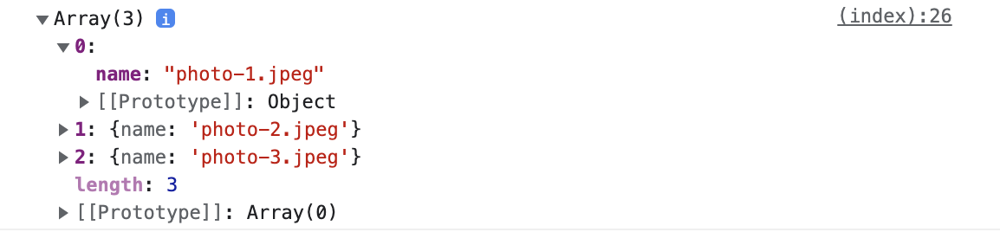

# Fetch images from json file

### What is JSON?

> JSON (JavaScript Object Notation) is a lightweight data-interchange format. It is easy for humans to read and write. It is easy for machines to parse and generate.

[Short video explaining JSON, its uses and why it's so popular](https://www.youtube.com/watch?v=iiADhChRriM)

### Creating the JSON file

Let's create new file called `images.json` and place it inside our project root (where the `index.html` file is) with
the following content:

```json
[
  {
    "name": "photo-1.jpeg"
  },
  {
    "name": "photo-2.jpeg"
  },
  {
    "name": "photo-3.jpeg"
  }
]
```

The structure above is read as: one array of objects, each object has a property `name` and its value is a string (our
image name).

### Reading the JSON file

To read the files we will be using [`fetch()`](https://developer.mozilla.org/en-US/docs/Web/API/Fetch_API/Using_Fetch).
Fetch allows us to read URLs/files and work with their contents. Lets test it out by placing the following code above
the js we wrote in the previous step:

```html

<script>
    fetch('/images.json').then(function (response) {
        response.json().then(function (json) {
            console.log(json);
        })
    }).catch(function () {
        console.log('The images.json file could not be accessed.');
    });

    const images = ['photo-1.jpeg', 'photo-2.jpeg', 'photo-3.jpeg'];

    // selecting the row, so we can add more elements to it
    const row = document.querySelector('#gallery');

    images.forEach(function (image) {
        const imageUrl = 'images/' + image;

        const column = document.createElement('div'); // column is now a div
        column.classList.add('col-12');
        column.classList.add('col-md-6');
        column.classList.add('col-lg-4');

        const img = document.createElement('img');
        img.classList.add('img-fluid');
        img.classList.add('m-2');
        img.setAttribute('src', imageUrl);

        column.append(img);

        row.append(column);
    });
</script>
```

So, we are fetching the contents of the file, then we
are ["parsing the response from json"](https://developer.mozilla.org/en-US/docs/Web/API/Response/json) (meaning that we
are reading the file as json text and converting it to javascript so we can interact with it).

Then we are `console.log`-ing the result, which means we can
open [Chrome DevTools' Console](https://developer.chrome.com/docs/devtools/open/#console) and see the result.



The result is as we defined it at the beginning of this step:  one array of objects, each object has a property `name`
and its value is a string (our image name).

Let's use the array of objects parsed from our `json` file to replace the existing `images` array we created in the
previous step. To do that we will have to move the js code from the previous step in the code that executes *after* the
json file is parsed (the second `.then()` in our code):

```html

<script>
    fetch('/images.json').then(function (response) {
        response.json().then(function (json) {
            const images = json;

            // selecting the row, so we can add more elements to it
            const row = document.querySelector('#gallery');

            images.forEach(function (image) {
                const imageUrl = 'images/' + image;

                const column = document.createElement('div'); // column is now a div
                column.classList.add('col-12');
                column.classList.add('col-md-6');
                column.classList.add('col-lg-4');

                const img = document.createElement('img');
                img.classList.add('img-fluid');
                img.classList.add('m-2');
                img.setAttribute('src', imageUrl);

                column.append(img);

                row.append(column);
            });
        })
    }).catch(function () {
        console.log('The images.json file could not be accessed.');
    });
</script>
```

If you refresh the page now, you will see a blank page. Additionally, if the `Chrome DevTools' Console` is opened an
error will be shown. That happens because the `images` variable was an array of strings before, and now it's an array of
objects. We will have to update the code inside our `.forEach` loop to refer to `image.name` instead of just `image`.

```html

<script>
    fetch('/images.json').then(function (response) {
        response.json().then(function (json) {
            const images = json;

            // selecting the row, so we can add more elements to it
            const row = document.querySelector('#gallery');

            images.forEach(function (image) {
                const imageUrl = 'images/' + image.name;

                const column = document.createElement('div'); // column is now a div
                column.classList.add('col-12');
                column.classList.add('col-md-6');
                column.classList.add('col-lg-4');

                const img = document.createElement('img');
                img.classList.add('img-fluid');
                img.classList.add('m-2');
                img.setAttribute('src', imageUrl);

                column.append(img);

                row.append(column);
            });
        })
    }).catch(function () {
        console.log('The images.json file could not be accessed.');
    });
</script>
```

Now the page works properly! 👏

_The end._
