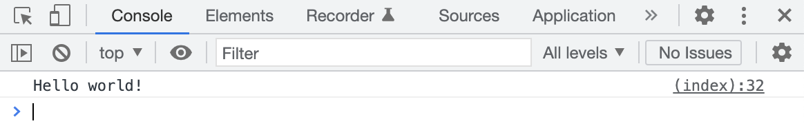

# Use JS to create HTML tags and add classes

### Minimum markup for an image

We now know that each image must be inside a column, so the responsive grid system provided by Bootstrap works.

```html

<div class="col-12 col-md-6 col-lg-4">
    
</div>
```

And each image column should be put inside our `.row` (that exists inside a `.container` div).

### Add `<script>` to our page

Open the `index.html` file and add a `<script>` tag just before the closing `</body>` tag and below the link to
Bootstrap's `js`:

```html
...
<script>
    // here be dragons!
</script>
</body>
```

Javascript is written inside `<script>` so the browser can distinguish js code from html.

### Working with JS

#### Executing JS from HTML

While coding in javascript inside HTML pages, we sometimes want to print variables or inspect `if`s, etc, the Chrome
DevTools' Console is a great tool to assist you in this.

Let's add a simple message in that Console by adding the following code to our `index.html`:

```html

<script>
    console.log('Hello world!');
</script>
```

Now go to Google Chrome and [open the Console](https://developer.chrome.com/docs/devtools/open/#console):



#### Storing the images names in a variable

Currently, we have three images, so let's create a constant of type array that holds the name of those images and print
it to the console:

```html

<script>
    const images = ['photo-1.jpeg', 'photo-2.jpeg', 'photo-3.jpeg'];
    console.log(images);
</script>
```

#### Iterating the new array and creating the tags

Now, since the `images` const is an array, we can iterate through the array
using [`.forEach`](https://developer.mozilla.org/en-US/docs/Web/JavaScript/Reference/Global_Objects/Array/forEach) and
execute the same block of code for each image:

```html

<script>
    const images = ['photo-1.jpeg', 'photo-2.jpeg', 'photo-3.jpeg'];

    images.forEach(function (image) {
    });
</script>
```

The variable `image` inside the `.forEach` loop is a string with the name of the image.

Each image resides inside our `images/` folder, so let's create a new variable `imageUrl` that will the path to each
image.

```html

<script>
    const images = ['photo-1.jpeg', 'photo-2.jpeg', 'photo-3.jpeg'];

    images.forEach(function (image) {
        const imageUrl = 'images/' + image;
    });
</script>
```

Using `javascript` and the [`document`](https://developer.mozilla.org/en-US/docs/Web/API/Document) object,
let's [`.createElement`](https://developer.mozilla.org/en-US/docs/Web/API/Document/createElement) a div which will
represent our column. Then we will add the classes: `.col-12`, `.col-md-6`, `.col-lg-4` to the newly created element.

```html

<script>
    const images = ['photo-1.jpeg', 'photo-2.jpeg', 'photo-3.jpeg'];

    images.forEach(function (image) {
        const imageUrl = 'images/' + image;

        const column = document.createElement('div'); // column is now a div
        column.classList.add('col-12');
        column.classList.add('col-md-6');
        column.classList.add('col-lg-4');

    });
</script>
```

If you refresh the page at this point you won't see any changes, so don't worry.

Since we'll be adding the columns (with images inside them) via javascript, we no longer need the markup we have
inside `div.row`, so let's remove it. Next add
the [`id` attribute](https://developer.mozilla.org/en-US/docs/Web/HTML/Global_attributes/id)
to `div.row` and set its value to `gallery`:

```html
...
<div class="container">
    <div class="row" id="gallery">
        <!--    Remove everything inside .row    -->
    </div>
</div>
...
```

Going back to our javascript code, inside the `<script>` tag above the closing `</body>`, let's use the `id` attribute
and select our `div.row`:

```html

<script>
    const images = ['photo-1.jpeg', 'photo-2.jpeg', 'photo-3.jpeg'];

    // selecting the row, so we can add more elements to it
    const row = document.querySelector('#gallery');

    images.forEach(function (image) {
        const imageUrl = 'images/' + image;

        const column = document.createElement('div'); // column is now a div
        column.classList.add('col-12');
        column.classList.add('col-md-6');
        column.classList.add('col-lg-4');

    });
</script>
```

> More information about [`document.querySelector()`](https://developer.mozilla.org/en-US/docs/Web/API/Document/querySelector)

So far we have:

- an array holding all images names
- a loop that iterates over that array
- inside the loop we define the path to each image
- and also create the div which will represent our column

Now it's time we create the `` tag, apply the proper classes to it
and [point it to our `imageUrl` by setting its `src` attribute](https://developer.mozilla.org/en-US/docs/Web/API/Element/setAttribute)
.

```html

<script>
    const images = ['photo-1.jpeg', 'photo-2.jpeg', 'photo-3.jpeg'];

    // selecting the row, so we can add more elements to it
    const row = document.querySelector('#gallery');

    images.forEach(function (image) {
        const imageUrl = 'images/' + image;

        const column = document.createElement('div'); // column is now a div
        column.classList.add('col-12');
        column.classList.add('col-md-6');
        column.classList.add('col-lg-4');

        const img = document.createElement('img');
        img.classList.add('img-fluid');
        img.classList.add('m-2');
        img.setAttribute('src', imageUrl);
    });
</script>
```

The newly created `` should be appended to the div we have in the `column` variable. To do that we will be using
the [`.append()` function](https://developer.mozilla.org/en-US/docs/Web/API/Element/append).

```html

<script>
    const images = ['photo-1.jpeg', 'photo-2.jpeg', 'photo-3.jpeg'];

    // selecting the row, so we can add more elements to it
    const row = document.querySelector('#gallery');

    images.forEach(function (image) {
        const imageUrl = 'images/' + image;

        const column = document.createElement('div'); // column is now a div
        column.classList.add('col-12');
        column.classList.add('col-md-6');
        column.classList.add('col-lg-4');

        const img = document.createElement('img');
        img.classList.add('img-fluid');
        img.classList.add('m-2');
        img.setAttribute('src', imageUrl);

        column.append(img);
    });
</script>
```

Our `column`s are ready last step is to add them to our `row` element so they can be visible on the page!

```html

<script>
    const images = ['photo-1.jpeg', 'photo-2.jpeg', 'photo-3.jpeg'];

    // selecting the row, so we can add more elements to it
    const row = document.querySelector('#gallery');

    images.forEach(function (image) {
        const imageUrl = 'images/' + image;

        const column = document.createElement('div'); // column is now a div
        column.classList.add('col-12');
        column.classList.add('col-md-6');
        column.classList.add('col-lg-4');

        const img = document.createElement('img');
        img.classList.add('img-fluid');
        img.classList.add('m-2');
        img.setAttribute('src', imageUrl);

        column.append(img);

        row.append(column);
    });
</script>
```

> **Note:** The `column` is being `.append()`-ed to the `row` inside the loop, because a new column is created for each image name inside the `images` array. 


If you refresh the page now, you should see the exact same thing as what we had at the end of the previous step. However! this time we load the images and create the elements dynamically using js.

In the next step, we will see how to structure a `json` file that holds the name of those images.
